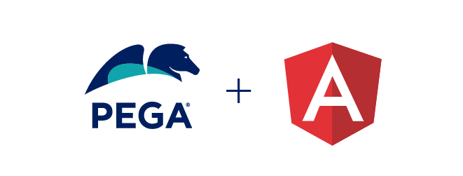

<p align="center">

# Angular SDK Components

The **Angular SDK Components** repo is used to create the [**@pega/angular-sdk-components**](https://www.npmjs.com/package/@pega/angular-sdk-components)
and [**@pega/angular-sdk-overrides**](https://www.npmjs.com/package/@pega/angular-sdk-overrides) npm packages
used by the Pega [**Constellation Angular SDK**](https://community.pega.com/marketplace/component/angular-sdk).
These packages provide the initial set of components used by the **Angular SDK** to render DX Components with
a design system other than Pega Constellation design system.

This repository is provided to allow **Angular SDK** users easier access to the source code for
the DX Components that are in the npm packages mentioned above. As a public repo, we expect
that most users will use it as a reference to review and learn from the code that's in the
npm packages.

To create a project to use the Constellation Angular SDK, please use the **Angular SDK**. You can get started
with the Angular SDK using the information (including pointers to online documentation) at
[**Pega Community**](https://community.pega.com/marketplace/component/angular-sdk) and the Angular SDK code
on [**GitHub**](https://community.pega.com/marketplace/component/angular-sdk).

## Quick start for developers

Clone this repository to build and customize your own Constellation Angular app, then:

```bash
npm ci
cp .env.example .env && $EDITOR .env     # Infinity URL, OAuth client ID, ...
set -a; source .env; set +a
npm run configure                        # writes sdk-config.json from the environment
npm run doctor                           # pre-flight check of your setup
npm run start-dev                        # http://localhost:3500
```

| | |
| --- | --- |
| Setup walkthrough | [docs/getting-started.md](docs/getting-started.md) |
| Configuration reference (`sdk-config.json`, environment variables) | [docs/configuration.md](docs/configuration.md) |
| CI/CD (GitHub Actions, Azure DevOps, GitLab, Jenkins), Docker, E2E | [docs/ci-cd.md](docs/ci-cd.md) |
| Customize, override or add components | [docs/customizing.md](docs/customizing.md) |
| Troubleshooting | [docs/troubleshooting.md](docs/troubleshooting.md) |

## Packages in this repo

* [**angular-sdk-components**](https://www.npmjs.com/package/@pega/angular-sdk-components) <br />
This package contains the source code for the Pega-provided **bridge** (in src/bridge)
from the [**ConstellationJS Engine**](https://www.npmjs.com/package/@pega/constellationjs) to
the **DX components** (in src/components). The DX Components are a reference implementation that
uses the [Angular Material](https://v15.material.angular.io/) design system. The bridge and components are
published in the [**@pega/angular-sdk-components**](https://www.npmjs.com/package/@pega/angular-sdk-components)
npm module.

* [**angular-sdk-overrides**](https://www.npmjs.com/package/@pega/angular-sdk-overrides) <br />
Scripts in this repo process the components in the **angular-sdk-components** package to provide
an initial implementation for SDK users who want to **override** the Angular SDK's Pega-provided
implementation. The source code for these override components is published in the
[**@pega/angular-sdk-overrides**](https://www.npmjs.com/package/@pega/angular-sdk-overrides) npm module.


<hr />

## License

This project is licensed under the terms of the **Apache 2** license.

You can see the full license [here](LICENSE) or directly on [apache.org](https://www.apache.org/licenses/LICENSE-2.0).


<hr />

## Contributing

We welcome contributions to the Angular SDK Components project.

Refer to our [guidelines for contributors](./docs/CONTRIBUTING.md) if you are interested in contributing to the project.

<hr />

## Additional Resources

* [Constellation Angular SDK on Pega Community](https://community.pega.com/marketplace/component/angular-sdk)
* [Constellation Angular SDK code](https://github.com/pegasystems/angular-sdk)
* [Constellation SDKs Documentation](https://docs.pega.com/bundle/constellation-sdk/page/constellation-sdks/sdks/constellation-sdks.html)
* [Troubleshooting Constellation SDKs](https://docs.pega.com/bundle/constellation-sdk/page/constellation-sdks/sdks/troubleshooting-constellation-sdks.html)
* [MediaCo sample application](https://docs.pega.com/bundle/constellation-sdk/page/constellation-sdks/sdks/mediaco-sample-application.html)
* [Angular](https://angular.io/)
* [Angular Material](https://v15.material.angular.io/)
