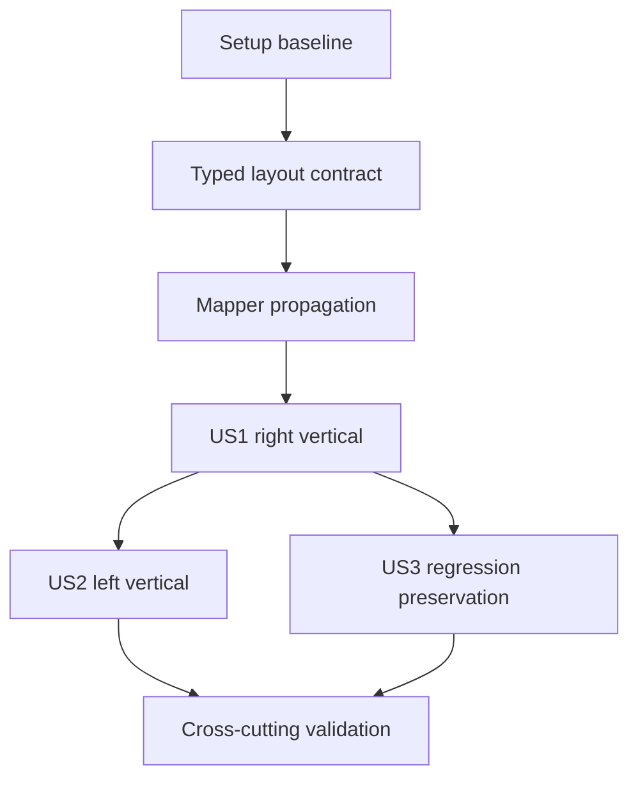

# Tasks: Vertical Stepper Alignment

**Input**: Design documents from `specs/001-vertical-stepper-alignment/`

**Prerequisites**: [plan.md](plan.md), [spec.md](spec.md), [research.md](research.md), [data-model.md](data-model.md), [multi-step navigation layout contract](contracts/multi-step-navigation-layout.md), [quickstart.md](quickstart.md)

**Tests**: Unit and end-to-end test tasks are required by FR-008 and the infrastructure testing standards.

**Organization**: Tasks are grouped by user story so that each behavior can be implemented and verified as an increment.

## Phase 1: Setup

**Purpose**: Establish the focused validation baseline before changing assignment navigation.

- [ ] T001 Run the current focused Assignment and MultiStep unit specs to record the baseline in `packages/angular-sdk-components/src/lib/_components/infra/assignment/assignment.component.spec.ts` and `packages/angular-sdk-components/src/lib/_components/infra/multi-step/multi-step.component.spec.ts`

---

## Phase 2: Foundational Contract

**Purpose**: Add the backward-compatible layout contract that all requested navigation modes use.

**⚠️ CRITICAL**: Complete this phase before modifying story-specific rendering.

- [X] T002 Add a typed optional `stepIndicator$` input and an effective-mode fallback to legacy `bIsVertical$` in `packages/angular-sdk-components/src/lib/_components/infra/multi-step/multi-step.component.ts`
- [X] T003 Preserve `bIsVertical$` while passing the optional layout indicator through the mapper props in `packages/angular-sdk-components/src/lib/_components/infra/assignment/assignment.component.html`

**Checkpoint**: The mapper contract supports explicit alignment without breaking existing MultiStep overrides.

---

## Phase 3: User Story 1 - Use a Right-Aligned Vertical Stepper (Priority: P1) 🎯 MVP

**Goal**: A multi-step assignment configured with `vertical` displays one navigation rail to the right of its assignment content while retaining step status and actions.

**Independent Test**: Configure multi-step navigation with `vertical`, render Assignment, and verify the right-aligned rail, exactly one assignment-content region, and current/completed visual states.

### Tests for User Story 1

- [X] T004 [P] [US1] Add case-insensitive `vertical` template-resolution expectations in `packages/angular-sdk-components/src/lib/_components/infra/assignment/assignment.component.spec.ts`
- [X] T005 [P] [US1] Add right-rail rendering, single-content-region, and legacy-input-fallback expectations in `packages/angular-sdk-components/src/lib/_components/infra/multi-step/multi-step.component.spec.ts`

### Implementation for User Story 1

- [X] T006 [US1] Normalize the navigation template, set right-vertical presentation for `vertical`, and preserve step-status derivation in `packages/angular-sdk-components/src/lib/_components/infra/assignment/assignment.component.ts`
- [X] T007 [US1] Render a dedicated vertical rail and one AssignmentCard content region for right-vertical presentation in `packages/angular-sdk-components/src/lib/_components/infra/multi-step/multi-step.component.html`
- [X] T008 [US1] Add the right-aligned rail/content grid, connector, and existing state-token styling in `packages/angular-sdk-components/src/lib/_components/infra/multi-step/multi-step.component.scss`

**Checkpoint**: `vertical` works as a right-aligned layout and can be validated without the left-alignment increment.

---

## Phase 4: User Story 2 - Use a Left-Aligned Vertical Stepper (Priority: P1)

**Goal**: A multi-step assignment configured with `vertical-left` displays the same vertical navigation rail to the left of assignment content.

**Independent Test**: Configure multi-step navigation with mixed-case `vertical-left`, render Assignment, and verify that the rail precedes content while actions and statuses remain available.

### Tests for User Story 2

- [X] T009 [P] [US2] Add case-insensitive `vertical-left` template-resolution expectations in `packages/angular-sdk-components/src/lib/_components/infra/assignment/assignment.component.spec.ts`
- [X] T010 [P] [US2] Add left-rail order and step-status rendering expectations in `packages/angular-sdk-components/src/lib/_components/infra/multi-step/multi-step.component.spec.ts`

### Implementation for User Story 2

- [X] T011 [US2] Map `vertical-left` to the left-vertical presentation indicator without changing existing hide rules in `packages/angular-sdk-components/src/lib/_components/infra/assignment/assignment.component.ts`
- [X] T012 [US2] Apply the left-vertical rail/content ordering branch in `packages/angular-sdk-components/src/lib/_components/infra/multi-step/multi-step.component.html`
- [X] T013 [US2] Add the left-aligned grid modifier using the shared rail/content styles in `packages/angular-sdk-components/src/lib/_components/infra/multi-step/multi-step.component.scss`

**Checkpoint**: Both vertical template values produce their required rail position with one assignment-content region.

---

## Phase 5: User Story 3 - Preserve Existing Navigation Behavior (Priority: P1)

**Goal**: Horizontal, unknown-template, standard, single-step, and no-navigation configurations preserve their existing presentation and assignment flow.

**Independent Test**: Render each existing configuration and verify horizontal remains horizontal, standard and single-step suppress navigation, and missing navigation uses AssignmentCard.

### Tests for User Story 3

- [X] T014 [P] [US3] Add standard, single-step, missing-navigation, horizontal, and unknown-template assertions in `packages/angular-sdk-components/src/lib/_components/infra/assignment/assignment.component.spec.ts`
- [X] T015 [P] [US3] Add horizontal rendering and explicit-indicator precedence assertions in `packages/angular-sdk-components/src/lib/_components/infra/multi-step/multi-step.component.spec.ts`

### Implementation for User Story 3

- [X] T016 [US3] Correct template normalization, visibility guards, and indicator precedence revealed by the regression tests in `packages/angular-sdk-components/src/lib/_components/infra/assignment/assignment.component.ts` and `packages/angular-sdk-components/src/lib/_components/infra/multi-step/multi-step.component.ts`

**Checkpoint**: All requested layouts and existing hidden/horizontal cases are covered by focused unit tests.

---

## Phase 6: Polish and Cross-Cutting Validation

**Purpose**: Validate assignment infrastructure across supported application modes and quality gates.

- [ ] T017 [P] Add a portal regression covering multi-step assignment actions and step-state visibility after the layout change in `projects/angular-test-app/tests/e2e/MediaCo/portal.spec.js`
- [ ] T018 [P] Add the equivalent embedded regression in `projects/angular-test-app/tests/e2e/MediaCo/embedded.spec.js`
- [ ] T019 Run the focused unit suites and full library test target from `specs/001-vertical-stepper-alignment/quickstart.md`
- [ ] T020 Run lint, library build, and the portal/embedded Playwright suites from `specs/001-vertical-stepper-alignment/quickstart.md`

---

## Dependencies and Execution Order



### User Story Dependencies

- **US1** depends on the foundational mapper contract and is the MVP.
- **US2** depends on US1's dedicated vertical rail/content structure and extends it with left ordering.
- **US3** depends on the foundational contract but can run after the shared source-file changes for US1 are merged; it protects existing paths without requiring US2.

### Parallel Opportunities

- T004 and T005 can run in parallel because they modify separate unit-spec files.
- T009 and T010 can run in parallel because they modify separate unit-spec files.
- T014 and T015 can run in parallel because they modify separate unit-spec files.
- T017 and T018 can run in parallel because they modify separate portal and embedded test files.

## Parallel Example: User Story 1

```text
Task: "Add vertical template-resolution expectations in packages/angular-sdk-components/src/lib/_components/infra/assignment/assignment.component.spec.ts"
Task: "Add right-rail rendering expectations in packages/angular-sdk-components/src/lib/_components/infra/multi-step/multi-step.component.spec.ts"
```

## Implementation Strategy

### MVP First

1. Complete T001-T003 to establish the compatible layout contract.
2. Complete T004-T008 to deliver right-aligned vertical navigation.
3. Run the focused unit checks and demonstrate US1 before expanding the layout modes.

### Incremental Delivery

1. Deliver US1 right vertical alignment with its focused tests.
2. Add US2 left vertical alignment as a small ordering extension of the established rail/content layout.
3. Add US3 regression tests and any resulting guard or precedence repair.
4. Complete portal, embedded, lint, build, and full test validation.

## Notes

- Every task follows the required checklist format with a task ID and exact path.
- `[P]` tasks target different files and can proceed concurrently once their stated dependency is complete.
- Do not change bridge or container lifecycle logic; preserve mapper-based rendering and legacy override compatibility.
